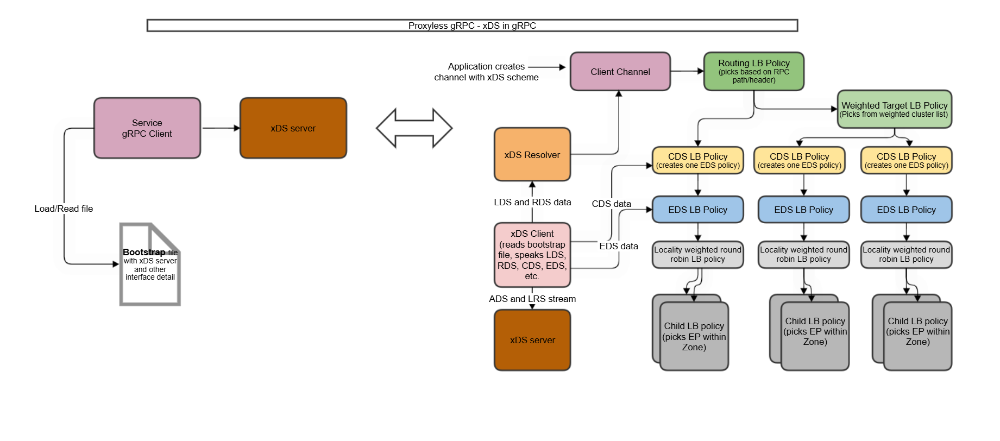

Proxyless gRPC service discovery using xDS

Thanks to gRPC group for enabling xDS. 

A working example of xDS control place server, with gRPC client and server.

This repository provides a control plane (xDS server) and example gRPC client and server. 
The intent of creating this repository is to provide a working example of XDS with capabilities like:
a. Dynamic discovery - gRPC server registration
b. Management of resources.
c. Static loading of service provider (aka gRPC server) 
d. And more (refer Service_Discovery folder)

I will keep updated files and notes.

1. High Level View

2. xDS Resources

3. xDS Routing Control

