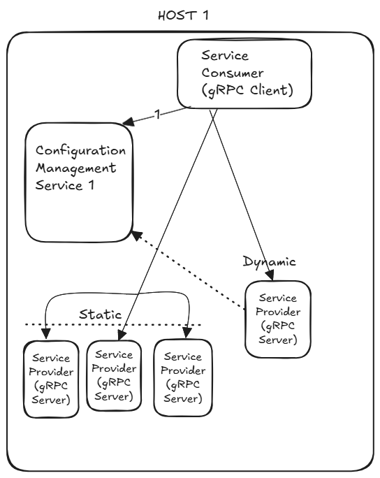
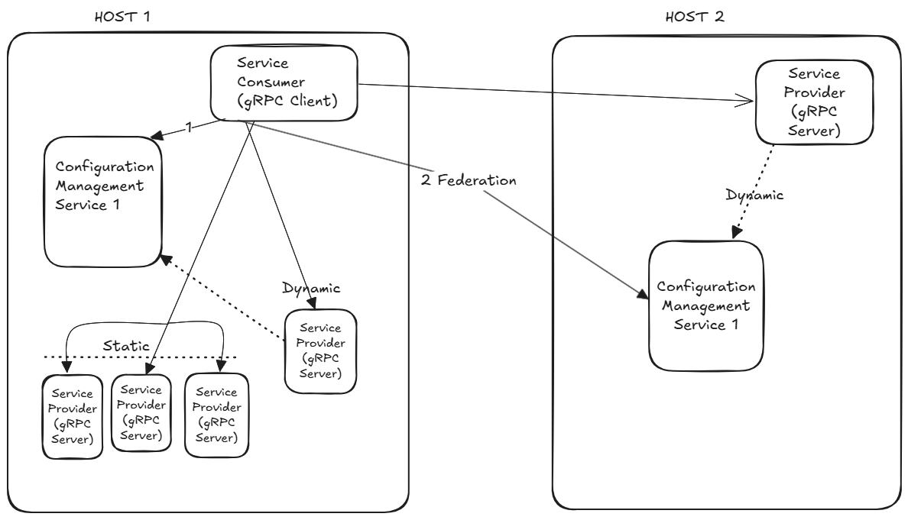

# Configuration Management using xDS

##### Configuration Management uses xDS APIs for dynamic configuration management. Enables proxy-less service connection and provides following capabilities:
  * Configuration Management Service (CMS):
    1. Resiliency/Failover:
        - Services using CMS can configure multiple CMSs.
    2. Support for publishing "State of the world" configuration to subscribers.  
  * Multi-Point Routing control (Essential for designing a scalable, multi-region service):
    1. Dynamic discovery of service provider. 
        - Enable dynamic scaling of service provider.
    2. Support for configuration loading for static service providers i.e. services that can not use dynamic discovery.
        - Allows onboarding of existing/legacy service providers.
    3. Traffic routing and volume control
        - Enable splitting traffic.
        - Decide volume of traffic for each path. 
        - Multiple layers, where traffic can be split with pre-defined ingress traffic volume ratio.
    4. Resiliency with priority and backup configuration settings.
        - Group service provider endpoints with different priority
        - Mark a group of endpoints as backup/standby.
    5. Spread configuration across multiple Configuration Managmenet Services (CMSs) running anywhere. 
        - Enable consumer service to switch CMS. Group service providers, place/run them anywhere and let local CMS manage configuration. 

---

#### How to run Configuration Management Service.
      > Go to "xds" folder/directory
	  > Configuration loading via yaml file, export configuration file path: export XDS_RESOURCE_FILE={Path to Resource configuration file}
		- export XDS_RESOURCE_FILE={Resource configuration file}
      > run: go run main.go --port #port

#### How to run xDS enabled gRPC Server (Service provider).
      > Go to "app" folder/directory
      > export bootstrap file: export GRPC_XDS_BOOTSTRAP={Upstream Bootstrap File} 

#### How to run xDS enabled gRPC Client (CMS user).
      > Go to "app" folder/directory
      > export bootstrap file: export GRPC_XDS_BOOTSTRAP={Client Bootstrap File}  
      > go run src/client.go --host xds:///{Listener Name} 	

---

## Example: 
* Clone this code.
* For simplicity, below steps assumes the code is cloned under "/home/user/cms/" 

### Here are examples to start using Configuration Management Service:

### 1. Combination of Static & Dynamic Service providers 
This example will show static and dynamic registration of service providers. A service consumer getting service provider detail from CMS and executing RPCs with multiple service providers.

The values (like ip, port, machine name, etc) will differ from what is in the file and host. 
HOST1: Below steps will show host1 ip as "1.1.1.1" 

##### Pre-Work:	
1. Clone code to both hosts 
2. Replace host IP with correct values in the client bootstrap files and ResourceFile.yml.
    * Resource file: Replace ip/port with static service ip/ports (leave other fields as is)
    * Client Bootstrap file Replace ip/port with CMS service ip/port. 
        > Line 4: "server_uri": "2.2.2.2:8001",  
	       &nbsp;&nbsp; Replace with HOST CMS IP and port. 
		
        > Neglect other ip/port at line 17, no change required.

##### Run Services:
  1. Start services, that will be part of static registry in CMS.
		* Go to "app" folder/directory
			> cd /home/user/cms/app
		* Start 3 services (these will be registered in CMS via file loading)
			> go run src/static_server.go  --grpcport 50051 --servername Startic_Server_1  
			> go run src/static_server.go  --grpcport 50053 --servername Startic_Server_2  
			> go run src/static_server.go  --grpcport 50055 --servername Startic_Server_3

  2. Start Configuration Management with static service provider endpoints (gRPC Server).
		* Go to "xds" folder/directory
			> cd /home/user/cms/xds
		* Export configuration file 
			> export XDS_RESOURCE_FILE=/home/user/cms/xds/ResourceFile.yml
		* Start CMS
			> go run main.go --port 8001
	
  3. Start service that can perform dynamic registration with CMS 
		* Go to "app" folder/directory
			> cd /home/user/cms/app
		* Export bootstrap file 
			> export GRPC_XDS_BOOTSTRAP='/home/user/cms/xds/bootstrap/server_register_with_resource_detail_bootstrap.json'
		* Start service 
			> go run src/server.go --grpcport 50057 --servername Dynamic_Server_4
	
  4. Start Consumer service (gRPC Client), that will connect to CMS, get resources and connect to 2 of static services and a dynamic registered service provider. 
		* Go to "app" folder/directory
			> cd /home/user/cms/app
		* Export bootstrap file 
			> export GRPC_XDS_BOOTSTRAP='/home/user/cms/xds/bootstrap/client_federation_support_bootstrap.json'
		* Start client service 
			> go run src/client.go --host xds:///primary.upstream.xdspoc.com
	
#### Expected Behavior: Observe Client session, each RPC call to different service providers, registered via static or dynamic registration way. Service provider can be identified based on client stdout, printed response will contain service provider name.

---
### 2. Combination of Static, Dynamic Service providers and two CMS services to support federation
This example will show static and dynamic registration of service providers with different CMSs. A service consumer getting service provider detail from multiple CMSs and executing RPCs with multiple service providers.

Best way to run this example, will require 2 hosts and steps below will guide through CMS setup on each host. 

#### Assumption, the values (like ip, machine name, etc) will differ. 
> HOST1: Below steps will show host1 ip as "1.1.1.1"  
> HOST2: Below steps will show host1 ip as "2.2.2.2"

#### TIP: As you go through below steps, HOST2 setup is very similar to above example setup. It would be easier to setup new machine/host as HOST1 steps.
#### Pre-Work:
1. Clone code to both hosts 
2. Replace host IP with correct values in the client bootstrap files and ResourceFile.yml.
    * Resource file: Under "endpoint", replace ip with static service ip/ports (leave other fields as is)
	  > Replace port/ip under "ClusterLoadAssignment:Endpoint:" with Static service ip and port
    * Client Bootstrap file: Replace ip with CMS service ip. 
	  > Line 4: "server_uri": "2.2.2.2:8001",   
	   &nbsp;&nbsp; Replace with HOST2 CMS IP and port. 
	  
	  > Line 17: "server_uri": "1.1.1.1:8001",  
	    &nbsp;&nbsp; Replace with HOST1 CMS IP and port.
		  
	
#### HOST1 SETUP - This host will run a CMS and one instance of service provider. 
  1. Start Configuration Management with static service provider endpoints (gRPC Server).
		* Go to "xds" folder/directory
			> cd /home/user/cms/xds
		* Export configuration file 
			> export XDS_RESOURCE_FILE=/home/user/cms/xds/ResourceFile.yml
		* Start CMS
			> go run main.go --port 8001
	
  2. Start service for dynamic registration with CMS 
		* Go to "app" folder/directory
			> cd /home/user/cms/app
		* Export bootstrap file 
			> export GRPC_XDS_BOOTSTRAP='/home/user/cms/xds/bootstrap/server_register_federation_bootstrap.json'
		* Start service 
			> go run src/server.go --grpcport 50057 --servername Dynamic_FEDERATION_Server1

#### HOST2 SETUP - This host will run a CMS, static and dynamic service providers and a client/consumer service. The setup is very similar to Above example "Combination of Static & Dynamic Service providers ".
  1. Start services, that will be part of static registry in CMS.
        * Go to "app" folder/directory
		    > cd /home/user/cms/app
        * Start 3 services (these will be registered in CMS via file loading)
        	> go run src/static_server.go  --grpcport 50051 --servername Startic_Server_1  
			> go run src/static_server.go  --grpcport 50053 --servername Startic_Server_2  
			> go run src/static_server.go  --grpcport 50055 --servername Startic_Server_3

  2. Start Configuration Management with static service provider endpoints (gRPC Server).
		* Go to "xds" folder/directory
			> cd /home/user/cms/xds
		* Export configuration file 
			> export XDS_RESOURCE_FILE=/home/user/cms/xds/ResourceFile.yml
		* Start CMS
			> go run main.go --port 8001
	
  3. Start service for dynamic registration with CMS 
		* Go to "app" folder/directory
			> cd /home/user/cms/app
		* Export bootstrap file 
			> export GRPC_XDS_BOOTSTRAP='/home/user/cms/xds/bootstrap/server_add_to_existing_cluster_xdstp_bootstrap.json'
		* Start service 
			> go run src/server.go --grpcport 50057 --servername Dynamic_Server_4
	
  4. Start Consumer service (gRPC Client), that will connect to CMS and connect to 2 of static services and a dynamic registered service provider. 
		* Go to "app" folder/directory
			> cd /home/user/cms/app
		* Export bootstrap file 
			> export GRPC_XDS_BOOTSTRAP='/home/user/cms/xds/bootstrap/client_federation_support_bootstrap.json'
		* Start client service 
			> go run src/client.go --host xds:///xdstp.upstream.xdspoc.com 

#### Expected Behavior: Observe Client RPC call going to service providers registered with different CMS (running on HOST1 & HOST2). Service provider can be identified based on client stdout, printed response will contain service provider name. 

